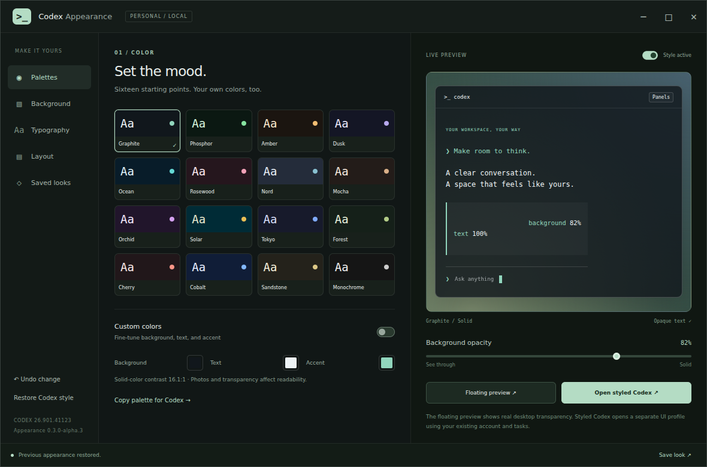
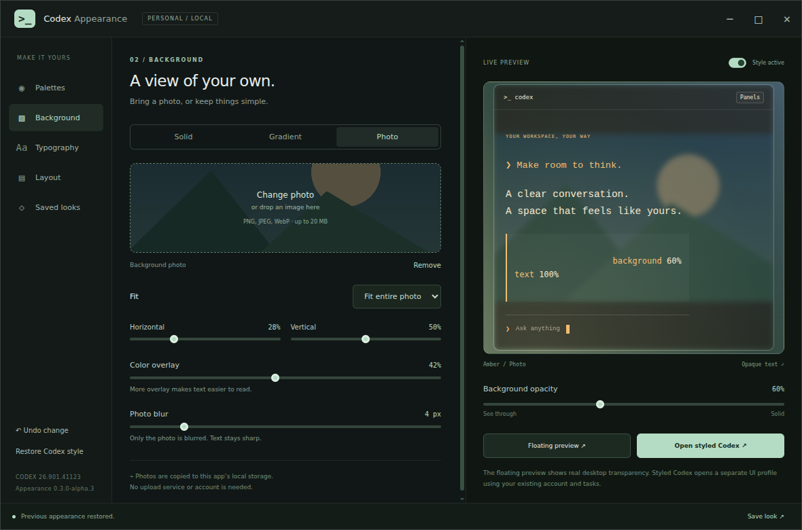
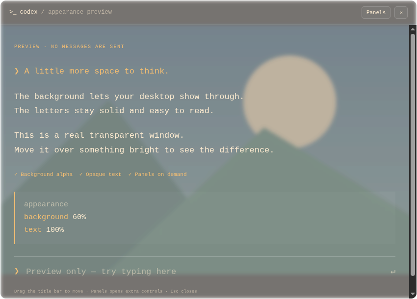

# Codex Appearance — desktop alpha

An unofficial appearance companion for compatible Codex desktop installations: local photo backgrounds, three included scenic looks, translucent backgrounds with opaque text, sixteen palettes, typography controls, and a sidebar you can reveal when needed.

**Experimental release: `0.6.0-alpha.1`.** Linux retains its existing integration. Mac Apple Silicon and Windows x64 now have packaged prototypes that open a reviewed native Codex installation with saved styling. Compatibility is build-specific; unsupported builds stop without changing installation files. Physical-device testing remains necessary. This project is not affiliated with or endorsed by OpenAI.

## Screenshots

Captured from the Linux companion and its floating preview. The sample text and generated landscape are demonstration content; these previews contain no private Codex conversations.

**Choose a palette.** Sixteen palettes, custom colors, and an opacity control with a live preview.



**Style the background.** The Photo mode accepts local images. This example uses the bundled landscape test image with the Amber palette, 60% background opacity, a 42% color overlay, and 4 px blur.



**Keep the text sharp.** The floating preview shows the same image with translucent background layers and fully opaque text. Desktop compositing varies by environment; a static screenshot cannot show every transparency effect.



## Platform support and sign-in

| Edition                          | Edit and preview looks | Open styled Codex                                     |
| -------------------------------- | ---------------------- | ----------------------------------------------------- |
| Linux x86_64 source              | Yes                    | Reviewed 26.901.41123 only                            |
| Mac ARM64 application prototype  | Yes                    | Reviewed 26.911.61220 only                            |
| Windows x64 executable prototype | Yes                    | Reviewed 26.908.70816 only                            |
| Native source editor             | Yes                    | Editor-only unless explicitly enabled for development |

**No login is needed to edit settings or style the signed-out screen.** Palettes, photos, saved looks, and previews are local. Chat and model access still require Codex authentication. Sign-in is handled by Codex itself, not this companion.

Native prototypes briefly use the reviewed application's existing loopback startup debugger to load the appearance hook before its window is created. The debugger connection and listener are then closed and checked. The installed application, signatures and security fuses are unchanged. A separate window profile keeps companion-launched UI preferences separate; normal runs still use Codex's normal authentication services. No appearance settings are uploaded.

The companion retains native Mac traffic lights and Windows window controls. **Looks → No look** removes the appearance and restores native background/material settings. Existing saved looks and preferences remain available. The transparent-window capability is established when the window is created; restarting ordinary Codex restores its entirely original window construction.

See the [native tester plan](docs/NATIVE-PORT.md) for compatibility, architecture coverage and reporting instructions.

## Open a native prototype

1. Install a compatible official Codex desktop build. The prototype does not include or install Codex. Do not downgrade a working installation just for this experiment; report an unsupported version so it can be reviewed.
2. Download the matching prototype ZIP and its `.sha256` file from [GitHub Releases](https://github.com/SkanderBog/codex-appearance/releases). Compare with `shasum -a 256 <archive>` on Mac or `Get-FileHash <archive> -Algorithm SHA256` in PowerShell.
3. Extract the ZIP. On **Mac Apple Silicon**, move **Codex Appearance.app** to Applications or another permanent folder and open it. On **Windows x64**, keep the entire extracted **Codex Appearance** folder together and open **Codex Appearance.exe**. Its DLLs and resources are required.
4. The companion automatically finds the reviewed installed Codex and opens it with your saved appearance. First launch uses Graphite. Change the appearance in the companion window; the styled Codex window updates automatically. If automatic discovery fails, use **Locate Codex** to choose the app or executable.

No Node, Python, Pillow, npm commands, or manual patching are required for these binary prototypes. They bundle their own editor runtime and image decoder. They are **unsigned/unnotarized prototypes**: the OS may ask for first-open confirmation or block them under organizational policy. Do not disable Gatekeeper, SmartScreen, or organization policy. Signed public installers remain future work.

Mac Intel and Windows ARM64 native integration have not been reviewed. A version match alone is insufficient: the launcher also checks the reviewed application code fingerprints. An updated or unsupported build produces an explanation instead of attempting an unreviewed hook.

## Run the native source editor instead

These are source packages, not signed application installers. Install Node.js 22.12+ and Python 3.10+ first. Download the matching `macos-editor-preview.zip` or `windows-editor-preview.zip` plus `SHA256SUMS.txt` from [GitHub Releases](https://github.com/SkanderBog/codex-appearance/releases), compare the archive's SHA-256 with the matching checksum line, then extract it. Use `shasum -a 256 <archive>` on Mac or `Get-FileHash <archive> -Algorithm SHA256` in PowerShell.

From the extracted folder, run:

```sh
npm ci --prefix desktop
```

This explicit installation downloads the pinned official Electron runtime and its dependencies; no Codex files are included. Then:

- **macOS:** create a local Python environment with `python3 -m venv .venv`, install Pillow with `.venv/bin/python -m pip install Pillow==11.3.0`, and run `COMPANION_PYTHON="$PWD/.venv/bin/python" bash launch-macos.command`. This also works when Finder does not expose your Node/Python PATH. Alternatively set `COMPANION_PYTHON` to an existing Pillow-enabled Python.
- **Windows (PowerShell):** run `py -3 -m venv .venv`, then `.\.venv\Scripts\python.exe -m pip install Pillow==11.3.0`. Set `$env:COMPANION_PYTHON = (Resolve-Path .\.venv\Scripts\python.exe).Path` and run `.\launch-windows.cmd`.

The editor runs locally after setup; neither Codex nor a Codex account is required. Electron selects the runtime for the machine running `npm ci`; do not copy `desktop/node_modules` between operating systems or architectures. Native file picking and desktop compositing still need broader manual testing. Mac Intel and Windows ARM64 native integration are not yet validated.

Native settings, photos, saved looks and editor profiles live in `~/Library/Application Support/codex-appearance` on Mac or `%LOCALAPPDATA%\codex-appearance` on Windows. Close the editor and remove the extracted source/runtime folder to uninstall; delete its data directory separately to remove saved settings. The Linux-only installer and runtime preparation scripts are not used by these editions.

## Try the Linux integration alpha

1. Download `codex-appearance-0.6.0-alpha.1-linux-x64.tar.gz` and `SHA256SUMS.txt` from [GitHub Releases](https://github.com/SkanderBog/codex-appearance/releases).
2. Verify and extract the download:

   ```sh
   sha256sum --ignore-missing -c SHA256SUMS.txt
   tar -xzf codex-appearance-0.6.0-alpha.1-linux-x64.tar.gz
   cd codex-appearance-0.6.0-alpha.1-linux-x64
   ```

3. On Ubuntu/Debian, install the small system dependencies if missing:

   ```sh
   sudo apt install python3 python3-pil zenity
   ```

   Python 3.10+, Pillow 9.0+, Bash, and an X11/XWayland graphical session are required. The five font choices use DejaVu, Liberation, and Nimbus; your system's fallback fonts apply if a family is missing. No separate Node.js installation or `npm install` is needed to run the app.

4. You must already have the compatible Codex desktop build installed. This download contains only the companion's source; it does not include Codex, an Electron runtime, an account, or a Codex installer. The default installation location is `/usr/lib/chatgpt`. For a different location, set an absolute directory containing `ChatGPT` and `resources/app.asar`:

   ```sh
   export COMPANION_CODEX_INSTALL='/absolute/path/to/codex'
   ```

5. Check your setup, then launch:

   ```sh
   ./launch.sh doctor
   ./launch.sh
   ```

6. Choose a palette or photo, use **Floating preview**, then **Open styled Codex**. To add an application-menu shortcut:

   ```sh
   python3 scripts/install.py
   ```

Keep the extracted folder in place while using its shortcut. An optional `--desktop` flag also creates a desktop shortcut. A custom install location or Python interpreter must remain available in the environment when launching from the menu.

## What the styled launcher does

The launcher makes a local copy of your installed Codex executable and application archive, and links the supporting installed resources. It changes the copy's window construction and injects validated appearance CSS through the runtime's in-process debugger. It opens no remote debugging port and leaves the original installed files unchanged. Preparation checks the exact supported build and integration fingerprint before making a copy. The installed application must remain available.

**Styled Codex uses your existing Codex account, tasks, projects, tools, and permissions.** Its separate UI profile is not a backend or filesystem sandbox. Actions you take there can affect your usual account and files. The companion sends no prompts itself. Codex retains its own network behavior and data policies.

The companion's own renderer has sandboxing, context isolation, no Node integration, a restrictive content policy, and a small validated IPC interface. The launcher never disables Chromium's sandbox.

## Controls

| Page       | Options                                                                                                                       |
| ---------- | ----------------------------------------------------------------------------------------------------------------------------- |
| Palettes   | Sixteen dark palettes, custom colors, contrast estimate, native theme-string export                                           |
| Background | Solid, gradient, or local photo; opacity; crop; tint; blur; photo-derived colors; separate home/conversation artwork strength |
| Typography | Interface font, conversation size, code size, line spacing                                                                    |
| Layout     | Sidebar visibility, conversation width, reduced animation, independent surface opacity and conversation shading               |
| Looks      | Three included scenic looks; save, search, update, import, and export your own looks                                          |

**Ctrl+O** chooses a photo. **Ctrl+S** saves a look. **Undo change** and **Redo change** navigate recent appearance changes in the current session; **Ctrl+Z**, **Ctrl+Shift+Z**, and **Ctrl+Y** work outside text fields. A new appearance edit clears redo history. Reset restores defaults while keeping saved looks. **Restore Codex style** disables the appearance layer while preserving your preferences.

In Photo mode, **Match colors to photo** suggests a dark background, text, and accent palette using local image sampling. It preserves your crop, blur, opacity, and typography; Undo restores the previous colors. Photos and desktop transparency still affect actual text contrast.

**Home artwork** and **Conversation artwork** independently control how strongly the photo shows on each screen. Zero covers the photo with the palette background; **Background opacity** still controls desktop transparency. Use **Home / Conversation** in the live preview, or the screen button in the floating preview, to compare both treatments.

Under **Layout**, adjust sidebar, header, and input opacity independently. **Conversation shading** adds a background behind message areas. These controls change background color alpha, never text opacity. Existing looks start with these new surface controls at zero and artwork strength at 100%, preserving their appearance.

**No look** at the top of the **Looks** page switches off the appearance layer and restores the normal Codex style. Both previews become plain. Your custom settings and saved looks are retained; choose a look again, enable **Style active**, or use Undo to bring the appearance back. The choice persists when reopening the companion or launching styled Codex.

The **Looks** page includes Cathedral Foundry, Arcade Signal, and Night Shift, adapted from individually MIT-licensed Codex Habitat themes. Applying one replaces appearance settings and can be undone. Their artwork and theme attribution travels with exported looks; see [third-party notices](THIRD_PARTY_NOTICES.md).

Search saved looks by name, palette, or background type. **Update** opens a dialog to replace that saved look with your current appearance and optionally rename it. Cancel leaves the saved look unchanged. Appearance undo/redo does not undo changes to the saved-look library.

Styled Codex checks input visibility and pointer reachability, conversation scrolling, and horizontal overflow before and shortly after applying styles. A detected regression disables the layer and shows a notice in the companion when refreshed. These checks compare geometry, read no message text, and do not guarantee every possible layout remains correct. **Ctrl+Alt+R** remains available for manual restoration.

In styled Codex, **Panels** sits beside the application menus. **Panels**, **Ctrl+B**, or **Ctrl+Alt+F** reveals the sidebar. **Ctrl+Alt+R** disables the layer. The ordinary menus and command menu remain available. Conversation width automatically fits the space beside a pinned summary, including while the panel animates. Close styled Codex and launch ordinary Codex to restore the original native window frame.

**Copy palette for Codex** creates a native dark-theme import string for **Settings → Appearance → Dark theme → Import** on the tested build. Photos, transparency, and sidebar styling require the companion launcher.

For the lightest rendering, use a solid background, set opacity to 100%, enable **Reduce motion**, and close the floating preview when it is not needed. Hidden or minimized previews defer styling until shown again. The companion uses file-change notifications for settings, combines rapid updates, and avoids rescanning the page for ordinary conversation text updates. These changes reduce companion overhead; the installed Codex app still uses its own CPU and memory.

Photo blur affects only the photo. Desktop blur and free rearrangement of Codex panels are not implemented. Transparent-window resizing and compositing can vary by environment; see [Electron's documented limitations](https://www.electronjs.org/docs/latest/tutorial/custom-window-styles#limitations).

## Data and privacy

The companion has no analytics, update service, or photo upload service. It reads the installed runtime, its own data, and files you select. Images are limited to 20 MB and 40 megapixels, normalized to JPEG, resized to a maximum edge of 2560 pixels, and stripped of EXIF metadata. Original images are left unchanged.

Fresh installations use:

| Data                                                   | Default location                                                                                      |
| ------------------------------------------------------ | ----------------------------------------------------------------------------------------------------- |
| Settings, photos, saved looks, UI profiles, local logs | `$XDG_DATA_HOME/codex-appearance` or `~/.local/share/codex-appearance`                                |
| Private runtime copy                                   | `$XDG_CACHE_HOME/codex-appearance/<installation-id>` or `~/.cache/codex-appearance/<installation-id>` |
| Explicit diagnostic reports and screenshots            | `diagnostics/` inside the data directory                                                              |

Existing development installations with `.state/appearance.json` keep using that local `.state` directory. Set `COMPANION_STATE_DIR`, `COMPANION_RUNTIME_DIR`, or `COMPANION_OUTPUT_DIR` to absolute paths to override the defaults. Diagnostic runs should use a separate temporary state directory.

An exported look includes its photo's **visible content** and the look name you choose. The original photo filename is replaced with a generic label. Review the photo before sharing; metadata removal cannot remove identifying details visible in the image.

Runtime copies, account profiles, user photos, logs, diagnostic screenshots, and local settings are excluded from the release manifest and Git. The reviewed demonstration images in `docs/screenshots/` are included. Ordinary diagnostics do not record Codex window titles. Explicit integration screenshots can still show private account content: do not publish the diagnostics directory. See [PRIVACY.md](PRIVACY.md).

## Recovery and removal

Ordinary Codex remains available independently. To close only the separate styled instance or the companion associated with the selected storage paths:

```sh
python3 scripts/stop-test.py codex
python3 scripts/stop-test.py companion
```

Remove the menu shortcut while retaining your settings:

```sh
python3 scripts/install.py --uninstall
```

Add `--desktop` to remove that shortcut too. After closing the windows, you may delete the extracted folder and its runtime cache. Delete the data directory separately only if you also want to remove your settings, photos, and UI profiles. Shared Codex account data is not removed.

Advanced: `./launch.sh codex` uses Codex's usual UI profile. Quit ordinary Codex first or its existing window may be focused. The default **Open styled Codex** button uses the separate profile.

## Troubleshooting

- **Unsupported build / fingerprint mismatch:** stop and use ordinary Codex. Do not bypass the check or downgrade a working installation solely for this alpha. New integration support requires review and tests.
- **No usable sandbox:** Ubuntu may restrict user namespaces for private executables. The launcher can use an existing root-owned setuid Chromium sandbox helper, including one from an installed Chrome/Chromium browser. It never changes AppArmor or helper permissions. A successful preflight cannot guarantee that the kernel will permit launch. Use a properly installed distribution/browser helper or a suitable local security policy; see [Chromium's guidance](https://chromium.googlesource.com/chromium/src/+/main/docs/security/apparmor-userns-restrictions.md). Do not run the companion as root or add `--no-sandbox`.
- **Pillow missing under a custom Python:** set `COMPANION_PYTHON` to the interpreter with Pillow installed. It is used for setup and photo processing.
- **File picker missing:** install Zenity. The preflight checks for it.
- **No display:** run in your graphical desktop session with X11/XWayland enabled.
- **Desktop launch failure:** inspect `desktop-launch.log` in the data directory. Logs may contain local paths; redact before sharing.
- **Unexpected appearance or resize behavior:** disable the layer with **Ctrl+Alt+R**, then reopen ordinary Codex if necessary.

## Development and verification

Node.js 22+ is used only for development. `npm ci` installs one pinned formatter; the companion has no npm runtime dependencies. Dependency installation does not prepare or launch Codex; `npm run prepare-runtime` is the explicit preparation command.

```sh
npm ci
npm run check
npm run format:check
npm test
npm run release:check
npm run release:build
```

The release builder uses `release-files.txt`, rejects symlinks and private directories, scans for common credentials and personal paths, strips archive ownership/timestamps, and verifies the finished archive. `python3 scripts/release.py --check --git` also checks the tracked file list and reachable Git history. Automated scans support, but cannot replace, manual review.

GUI verification requires a supported Codex installation and a graphical session:

```sh
export COMPANION_STATE_DIR="$(mktemp -d)"
./launch.sh self-test
COMPANION_CHECK=1 ./launch.sh codex-test
```

Run `npm run benchmark` for an isolated 400-update photo-preview workload. It reports process CPU time, elapsed time, and photo reads; results vary by machine and do not measure total Codex CPU.

The self-test covers real controls, photo import, saved looks, undo, and transparency. The Codex integration check sends no prompts, tests the existing app's rendering, and writes a local report. Close its separate window after reading the report. Tests temporarily modify the selected state directory; never run them against state used by another active companion.

See [TESTING.md](TESTING.md) for results and remaining coverage, [CONTRIBUTING.md](CONTRIBUTING.md) for contributions, and [SECURITY.md](SECURITY.md) for private vulnerability reporting.

## License

The companion's source, original icons, and generated test fixtures are provided under the [MIT license](LICENSE). The three included Habitat looks retain their [upstream MIT license](assets/themes/LICENSE) and [attribution](THIRD_PARTY_NOTICES.md). No Codex application files are included. Native binary prototypes include Electron and a frozen Python/Pillow helper, with their license notices inside the app resources. Their licenses and terms remain separate.
